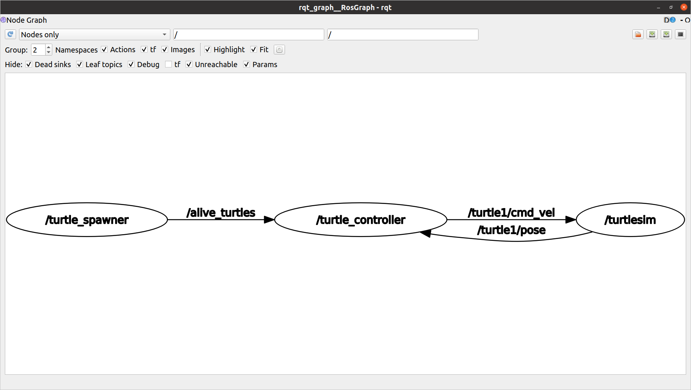

Turtlesim “Catch Them All” project

Time to start your first complete project with ROS 2!

For this project you will use the Turtlesim package as a simulation tool, so you can visualize what the robot is doing.

Before going further, make sure you’ve watched the video with the final result you should get (“Turtlesim Project - Final Result Overview” video).

If this sounds hard, well, yes, it’s certainly harder than what we previously did in this course. But it’s totally doable if you’ve understood the concepts, how to apply them, and of course if you take enough time to work on the project.

At any time feel free to come back to previous lessons on the course. Solving problems when you work on a project is one of the best ways to learn, because the lessons you’ll watch again will be directly linked to a practical problem.

How is it organized
I have separated the solution into different parts, so that it will be easier for you to navigate. Also, if you really feel stuck at some point, you can watch only one part of the solution, and then go back to work on the next part by yourself.

So:

First try to design the application by yourself. Don’t write code! Just take a piece of paper and make the design. What nodes should you create? How do the nodes communicate between each other? Which functionality should you add, and where to put them? Etc.

Then, either you directly start on your own (let’s call this the hardcore mode), or read the next part where I give you some tips for the design.

Then, work step by step on each functionality/communication. You can decide to break the project as I did, and for each step, write the code, and then watch the solution. Or you can ignore the solution and challenge yourself to do everything by yourself.

Just do as you feel. The more independent you are on the project, the better. However, don’t stay stuck for days or weeks, if you have to watch parts of the solution, it’s fine too. In this case, a nice challenge would be to do the project again a few days later, without any help this time.

Note: the design + code I propose is ONLY one possible solution. You might end up with a totally different code, but still working. And that’s great too! The real goal here is to make what you saw on the demo video (and also keep in mind to make your code clean and scalable).

As an additional help, you can download the code for each step (contains both Python and Cpp code for the step).

## Some Tips to Get Started
(Note: For more convenience when you work on the project, I've made up a PDF with all the instructions from "Your Challenge" + "Some Tips to Get Started". The PDF is attached to this lecture, you can download it and keep it on the side when you're doing the project)

Some tips to help you get started
Here are some tips to help you get started with this Turtlesim project.

You will use 3 nodes:

The turtlesim_node from the turtlesim package.

A custom node to control the turtle (named “turtle1”) which is already spawned in the turtlesim_node. This node can be called turtle_controller.

A custom node to spawn turtles on the window, and to manage which turtle is still “alive” (on the screen). This node can be called turtle_spawner.

You can create a new package (for example turtlesim_catch_them_all) to put your new nodes.

The turtle_spawner node will have to:

Call the /spawn service to create a new turtle (choose random coordinates between 0.0 and 11.0 for both x and y), and call the /kill service to remove a turtle from the screen. Both those services are already advertised by the turtlesim_node.

Publish the list of currently alive turtles with coordinates on a topic /alive_turtles.

Handle a service server to “catch” a turtle, which means to call the /kill service and remove the turtle from the array of alive turtles.

The turtle_controller node will have to:

Run a control loop (for example using a timer with a high rate) to reach a given target point. The first turtle on the screen “turtle1” will be the “master” turtle to control. To control the turtle you can subscribe to /turtle1/pose and publish to /turtle1/cmd_vel.

The control loop will use a simplified P controller.

Subscribe to the /alive_turtles topic to get all current turtles with coordinates. From that information, select a target turtle (turtle to catch).

When a turtle has been caught by the master turtle, call the service /catch_turtle advertised by the turtle_spawner node.

You will need to create some custom interfaces:

Turtle.msg and TurtleArray.msg to send the list of turtles (name + coordinates) on the /alive_turtles topic.

CatchTurtle.srv to send the name of the turtle which was caught. The client will be the turtle_controller node and the server will be the turtle_spawner node.

→ you can create messages in the my_robot_interfaces package.

Here’s the rqt_graph with the nodes and topics:

After you’ve created that, you will be able to scale the application with parameters and launch files. This will be the focus on the last part of the solution.

Here are the parameters you can have:

/turtle_controller:

catch_closest_turtle_first

/turtle_spawner:

spawn_frequency

turtle_name_prefix

You can create the launch file (and YAML param file) inside the my_robot_bringup package. This will launch the 3 nodes along with parameters.

Steps for the solution videos:

Step 1: Create the turtle_controller node, subscribe to /turtle1/pose. Create a control loop to reach a given target (for now an arbitrary one). A little bit of math will be required to find the distances and angles. Send the command to the /turtle1/cmd_vel topic.

Step 2: Create the turtle_spawner node. With a timer, spawn a new turtle at a given rate. To spawn a turtle, call the /spawn service.

Step 3: Keep an array of alive turtles (name + coordinates) in the turtle_spawner node. Publish this array on the /alive_turtles topic. On the turtle_controller node, subscribe to the topic, get the array, and choose to select the first turtle on the array as the new target.

Step 4: Create a service /catch_turtle in turtle_spawner. Once the turtle_controller has reached a turtle, it will send the turtle name to that service. Then, from the turtle_spawner node, call the /kill service , remove the turtle from the array, and publish an updated array to /alive_turtles.

Step 5: Improve the turtle_controller to select the closest turtle instead of the first turtle on the array.

Step 6: Add parameters and create a launch file + YAML param file.

(Step 1 and Step 2 are completely independent, you can do Step 2 first if you prefer)

Alright, time for you to start working on this project!