## Section Conclusion 1
In this section you have installed ROS 2 on Ubuntu and configured your environment.

That was quite a lot of things, but you’ve made it, congratulations! The installation process is maybe not the funniest one, but a necessary one.

Quick recap on which ROS 2 version to use:

Use the latest LTS ROS 2 version. For now this version is ROS 2 Jazzy (released in 2024). Note: if you’ve already started with ROS 2 Humble, no problem, this is an LTS release too and will still be supported until mid-2027.

Sometimes you may wait a little bit more (6 months to 1 year) before using the latest LTS, because some needed packages are not ported yet. In this case keep using the penultimate LTS.

About the (non ROS-specific) tools I use:

IDE and text editor: VS Code and gedit. Feel free to use any other IDE you want, it’s best that you keep using the tools you’re more comfortable with.

To have multiple terminals on screen: Terminator (Ubuntu). If you don’t want to use Terminator, you can just open multiple terminals and tabs inside terminals. Another well known program similar to Terminator is tmux.

And one thing to remember:

Always source your environment before you use ROS 2, otherwise you’ll get an error.
```bash
"source /opt/ros/jazzy/setup.bash" (put this in your ~/.bashrc)
```

Change "jazzy" with whatever ROS2 distribution you're using.

Alright, now you’re fully ready to go to the next step, and start writing your own ROS 2 programs!


## OOP Template for Your Nodes
Here’s a template you can use for all your nodes. Make sure you understand what each line does by rewatching (if needed) the previous lectures.

From now on I will start the nodes from this template so we don’t waste time always writing the same code at the beginning of each video.

OOP Python Code Template for Nodes

```python
#!/usr/bin/env python3
import rclpy
from rclpy.node import Node
 
 
class MyCustomNode(Node): # MODIFY NAME
    def __init__(self):
        super().__init__("node_name") # MODIFY NAME
 
 
def main(args=None):
    rclpy.init(args=args)
    node = MyCustomNode() # MODIFY NAME
    rclpy.spin(node)
    rclpy.shutdown()
 
 
if __name__ == "__main__":
    main()
```

## OOP C++ Code Template for Nodes

```cpp
#include "rclcpp/rclcpp.hpp"
 
class MyCustomNode : public rclcpp::Node // MODIFY NAME
{
public:
    MyCustomNode() : Node("node_name") // MODIFY NAME
    {
    }
 
private:
};
 
int main(int argc, char **argv)
{
    rclcpp::init(argc, argv);
    auto node = std::make_shared<MyCustomNode>(); // MODIFY NAME
    rclcpp::spin(node);
    rclcpp::shutdown();
    return 0;
}
```
## RCL is the ROS Client Library +
RCL is the ROS Client Library . It is the library that allows nodes to communicate with the ROS 2 system. We have rclcpp, rclpy, rcljava.


## Section Conclusion
In this section you’ve seen how to create your own first ROS 2 nodes, in both Python and Cpp. This is already a good foundation. If you read this, then you’ve already made a lot of progress!

Quick recap: Nodes are subprograms in your application. Each node is responsible for only one thing. And nodes communicate between each other through topics, services, and parameters. If you look at the next few sections, well that’s exactly what we’ll work on.

Here’s an example of an architecture for a ROS 2 application, where you can see packages and nodes:
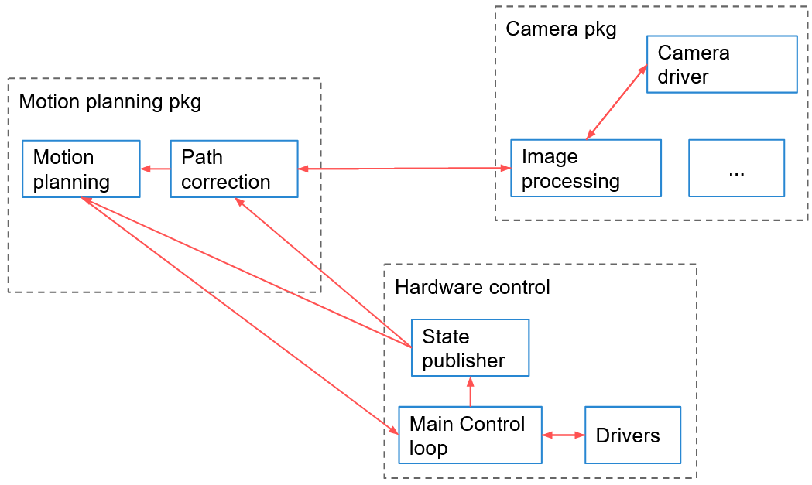
Before creating your first node you need to:

Create a ROS 2 workspace and source it.

Create a (Python/Cpp) package.

Then, you write your node using the appropriate ROS 2 client library: rclpy for Python, and rclcpp for Cpp. Both libraries will provide the same core functionalities.

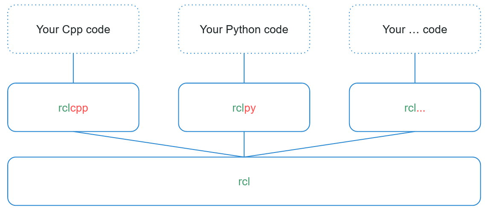

After writing the node, you compile it, and you re-source your environment in order to use it. Nodes are compiled (only for Cpp), and installed (for both Python and Cpp), inside the install/ folder of your ROS 2 workspace. You can directly execute them from here, or by using the command line tool “ros2 run <package> <executable>”.


If you don’t understand everything right now, it’s totally OK (and it’s quite normal). ROS concepts are quite hard to grasp the first time. Continue to make progress in the course, and come back to this section later. It will all make sense in the end and you’ll have a solid global overview.

In the next section, you’ll practice a little bit more with nodes, and you’ll discover some useful ROS 2 tools. Being comfortable with the tools will help you when working on Topics, Services, etc.


____________________________________


You can download the complete code for this section (attached to the "Section Conclusion" lecture, named "code_end_section_3.zip"). I’ve included everything that is inside the ROS 2 workspace, under the ~/ros2_ws/src/ folder.

Intro
You’re now able to create your own ROS 2 nodes in both Python and Cpp.

Great!

In this section you will learn more about some of the most useful ROS 2 tools. Those tools will allow you to start your nodes and introspect your whole ROS 2 application.

This is also a good opportunity to experiment more with nodes. Nodes are really the foundation of anything you’ll write in ROS 2.

What you’ll do in this section:

Run your nodes with ros2 run, and by adding more options so you can change the node’s name

Introspect nodes with ros2 cli (cli: Command Line Interface)

Visualize the complete graph of your application with rqt_graph

Discover Turtlesim, a 2D simulation

At the end of the section you’ll also be able to experiment more with a short activity. As we progress in the course I’ll give you more and more activities so you can spend more time experimenting and applying the concepts by yourself.

Let’s get started!

## ROS2 cli
```bash
jose@jose:~$ ros2 
action                          extension_points                node                            topic
bag                             extensions                      param                           --use-python-default-buffering
component                       interface                       pkg                             wtf
control                         launch                          run                             
daemon                          lifecycle                       security                        
doctor                          multicast                       service                         
```

## Rename a node in ROS 2 on execution
```bash
jose@jose:~$ ros2 run my_py_pkg  py_oop_node --ros-args -r __node:=abc
```
```bash
jose@jose:~$ ros2 run my_py_pkg  py_oop_node --ros-args --remap __node:=abc
```
# Colcon
Colcon is the build tool for ROS 2. It is used to build packages, and to install them.
Only build from the workspace folder.

Bulid all workspaces
```bash
jose@jose:~/ros2_ws$  colcon build
```

Build only one package
```bash
jose@jose:~/ros2_ws$  colcon build --packages-select my_py_pkg
```

On python packages you can use symlinks to the source folder, so you don’t have to build the package every time you change something.
```bash
jose@jose:~/ros2_ws$  colcon build --packages-select my_py_pkg --symlink-install
```
Import note: to use --symlink-install make sure the python files in this package are executable (in this case: my_first_node.py) Use the command "chmod +x " to make a file executable. 
No use --symlink-install very common use.

## Rqt graph
Rqt graph is a tool that allows you to visualize the complete graph of your ROS 2 application.

```bash
jose@jose:~$ rqt_graph
```

## TurtleSim
Turtlesim is a 2D simulation that allows you to control a turtle. It is a good way to get started with ROS 2.

To run turtlesim:
```bash
jose@jose:~$ ros2 run turtlesim turtlesim_node
```
To control the turtle you can use the keyboard. The following keys are available:

w: move forward
s: move backward
a: rotate left
d: rotate right
q: quit

```BASH
jose@jose:~$ ros2 run turtlesim turtles_teleop_key
```

With rqt_graph you can visualize the complete graph of your ROS 2 application.
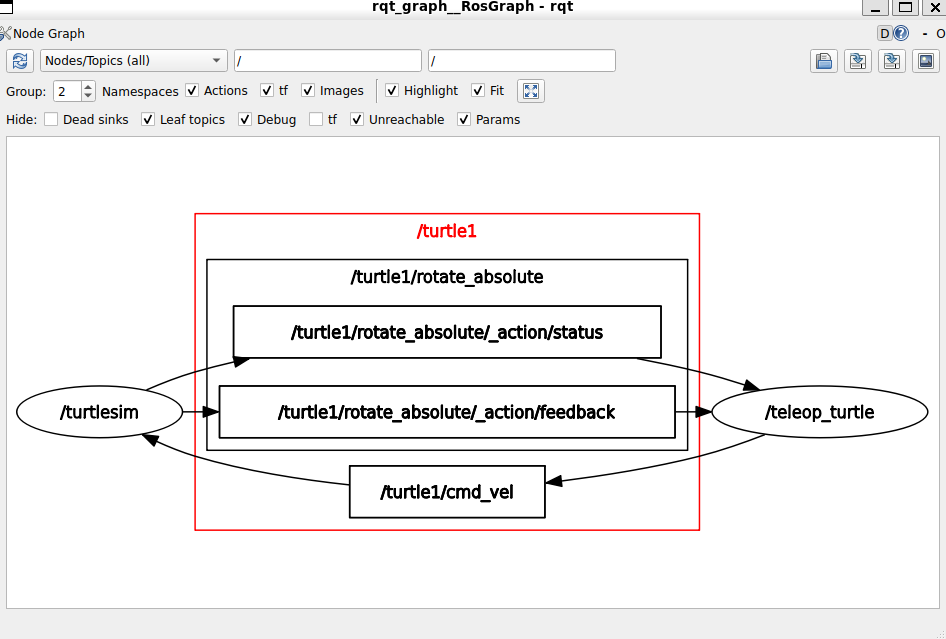

Create a new turtle:
```bash
jose@jose:~$ ros2 run turtlesim turtlesim_node --ros-args -r __node:=my_turtle
```

## Activity 01
Activity 01 - ROS 2 Nodes and Tools
[Note] in this course I will often give you some “activities” for you to practice the subjects you’ve learned. This will start with an explanation of the challenge (this lesson) and then the video solution is in the next lesson. I encourage you to try to do the activities on your own and give it some time - that’s the best way you can make progress. If needed, come back to the previous lessons for a quick refresher. Of course, no worries if you can’t manage to solve the challenge the first time. If stuck for too long, watch the solution, and give it another try in a few days. [/Note]

Here’s a quick challenge for you. I have run some nodes with different names, and here is what I see with rqt_graph.

(right click > "view image" to increase the size of the image in your browser)

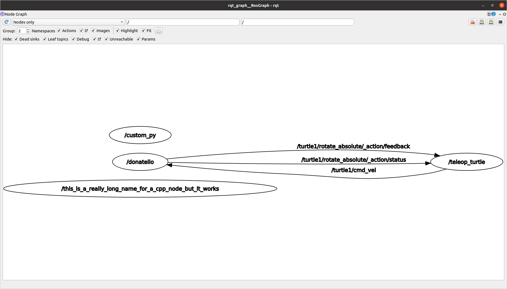

Your goal here is to get the same.

For that you’ll need to start 4 nodes, including those that you created before (the Python and the Cpp ones), and 2 nodes from the Turtlesim package.

No need to write any code here, you just have to start the nodes from your terminal, using the appropriate commands.

I will see you in the next lecture for the solution.


```BASH
jose@jose:~$ ros2 run turtlesim turtlesim_node --ros-args -r __node:=dontello
jose@jose:~$ ros2 run turtlesim turtle_teleop_key
jose@jose:~$ ros2 run turtlesim turtlesim_node --ros-args -r __node:=my_turtle
jose@jose:~$ ros2 run my_py_pkg py_oop_node --ros-args -r __node:=custom_py
jose@jose:~$ ros2 run my_cpp_pkg cpp_node_oop --ros-args -r __node:=this_is_a_relly_log_for_a_cpp_node_but_it_works
jose@jose:~$ rqt_graph
```

## Section Conclusion
In this section you’ve discovered 2 important tools you’ll use for any ROS 2 application you develop: the ros2 cli (Command Line Interface), and rqt with all its plugins. During the course you’ll continue to practice with those tools, and you’ll discover more of them.

You also discovered the Turtlesim package, containing a simplified 2D robot, which will be very useful to apply what you learn throughout the course.

So, with the last section on nodes + the activities from this section, you already have a good foundation and you can:

Create a custom node in your own package (Python and Cpp)

Compile and run your nodes

Launch and debug your nodes with different tools

Run existing nodes from other packages

Now, the next logical step is to see how those nodes can communicate between each other. And… That’s just what’s coming in the next section on ROS 2 Topics.

## Intro
It is now the time to explore ROS communication features.

At the end of this section you will be able to make your nodes communicate between each other, using ROS 2 Topics.

Here’s what you’ll do in this section:

- Understand what is a ROS 2 topic thanks to a real life analogy

- Write your own Topic (publisher/subscriber) in both Python and Cpp

- Debug topics with ROS 2 tools

- Experiment on Turtlesim

And finally, you’ll work on an activity to practice on everything you’ve seen until this point.

And now, what is a ROS 2 Topic?

## ROS2 Topics
- Understand what is a ROS 2 topic thanks to a real life analogy station radio
You can think of a topic as a radio station. You can have multiple stations (topics) broadcasting different types of information (messages). Each station has a unique name, and you can listen to the information being broadcasted by that station.

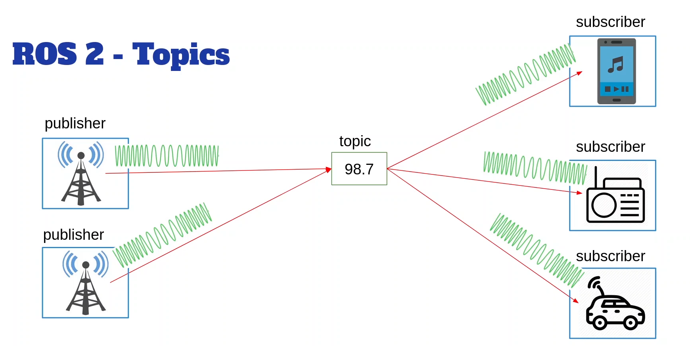
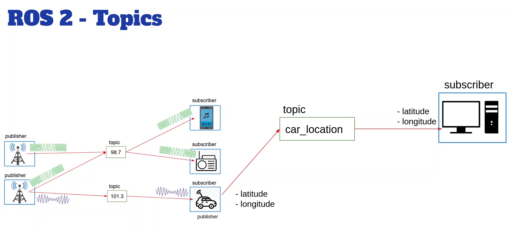

## ROS2 topics recommendations
- Use unique topic names to avoid confusion
- Use the same message type for both publisher and subscriber
- A topic is a named bus over which nodes exchange messages.
-  Undirectional data stream (publisher -/ subscriber)d
- Anonymous
- A topic has a message type
- Can be written in Python or Cpp, directly inside ROS nodes.
- A node can have many publishers/subscribers fro many topics

## Verify the frecuency of the node

```bash
ros2 topic hz /robot_news 
```

Measure the bandwidth of a topic

```bash
ros2 topic bw /robot_news
```
Show the info about a topic

```bash
ros2 topic info /robot_news
```

Publish a topic from the command line

```bash
ros2 topic pub -r5 /robot_news example_interfaces/msg/String "{data: 'Hello World'}"
```

Remap a node 

```bash
ros2 run my_py_pkg robot_news_station --ros-args -r __node:=my_station
```

Rename the topic also from publisher node

```bash
ros2 run my_py_pkg robot_news_station --ros-args -r __node:=my_station -r /robot_news:=/my_robot_news
```
Rame map the topic also from subscriber node

```bash
ros2 run my_py_pkg smartphone --ros-args -r robot_news:=my_robot_news
```

Info about topics

```bash
ros2 topic info  /turtle1/cmd_vel
```

Info about the interface

```bash
ros2 interface show geometry_msgs/msg/Twist
```

Publish from command line to turtle

```bash
ros2 topic pub -r 2 /turtle1/cmd_vel geometry_msgs/msg/Twist "{linear: {x: 1.0, y: 0.0, z: 0.0}, angular: {x: 0.0, y: 0.0, z: 1.0}}"
``` 

## Activity 02 - ROS2 Topics
It’s time for a new activity on ROS 2 topics.

Here is a representation of the graph you should get at the end.


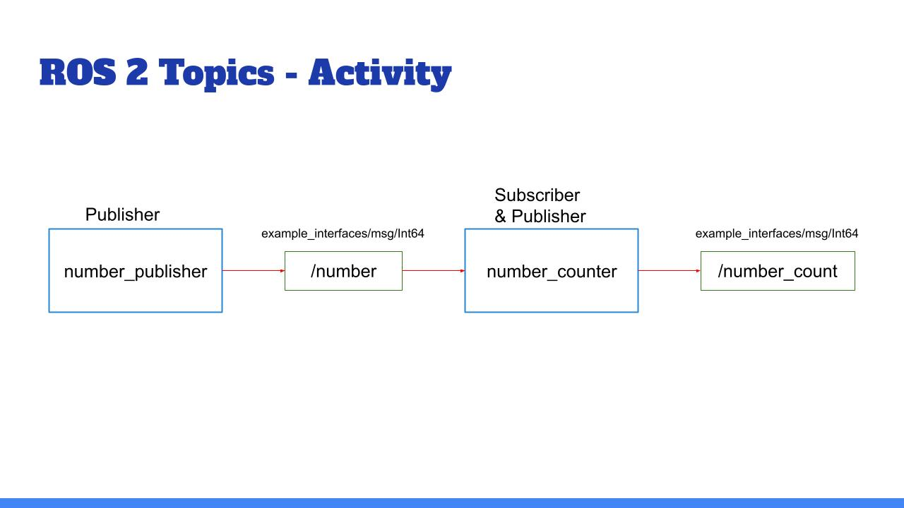

The blue boxes are nodes and the green boxes are topics.

And here’s the final result you should get in the terminal (of course the numbers may be different):


__________________________________________

ros2 topic echo /number_count

data: 38

---

data: 40

---

data: 42

---


__________________________________________


You’ll create 2 nodes from scratch. In the first one you’ll have 1 publisher, and in the second one, 1 publisher & 1 subscriber.

The number_publisher node publishes a number (always the same) on the “/number” topic, with the existing type example_interfaces/msg/Int64.

The number_counter node subscribes to the “/number” topic. It keeps a counter variable. Every time a new number is received, it’s added to the counter. The node also has a publisher on the “/number_count” topic. When the counter is updated, the publisher directly publishes the new value on the topic.

A few hints:

Check what to put into the example_interfaces/msg/Int64 with the “ros2 interface show” command line tool.

It may be easier to do the activity in this order: first create the number_publisher node, check that the publisher is working with “ros2 topic”. Then create the number_counter, focus on the subscriber. And finally create the last publisher.

In the number_counter node, the publisher will publish messages directly from the subscriber callback.

And now, let’s get to work! :)

Make sure you really spend some time on this activity, even if you can’t finish it. That’s the only way you will truly progress.

You can do this activity in both Python and Cpp. In fact, you could write the first node in Python, and the second in Cpp, and vice versa!

I’ll see you in the next lecture for the solution.

## Solution - Activity 02 - ROS2 Topics

Create packages python first
```bash
 ros2 pkg create my_first_activity_py_pkg --build-type ament_python --dependencies rclpy example_interfaces
```

Create packages Cpp second
```bash
 ros2 pkg create my_first_activity_cpp_pkg --build-type ament_cmake --dependencies rclcpp example_interfaces 
```
## Ros2 bags
```bash
ros2 bag record -o test /number_count

```
Check info of the bag
```bash
 ros2 bag info test
```
Play the bag
```bash
 ros2 bag play test
```

## Section Conclusion
In this section you have seen how to use ROS 2 Topics to communicate between your nodes.

Now, you can already create more complex applications!

To recap, a topic is:

A named bus over which nodes exchange messages

Used for unidirectional data streams

Anonymous: publishers don’t know who is subscribing, and subscribers don’t know who is publishing.

To implement topics in your ROS 2 application:

First create a node (or start from an existing one), then inside your node you can create any number of publishers/subscribers.

A publisher and subscriber must publish/subscribe to the same topic name, and use the same data type. Those are the 2 conditions for successful topic communication.

Then, once you’ve added some publishers/subscribers in your nodes, just launch your nodes, and the communication starts! You can debug them using the “ros2” command line tool, as well as rqt.

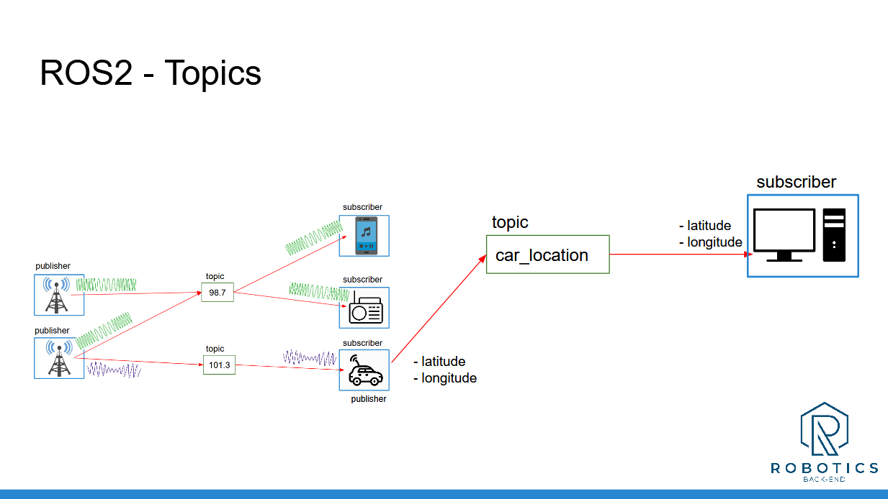

Note: your topic names should start with a letter (“98.7” is not a valid topic name, it was just used to introduce the concept with a real life analogy).

By using nodes, you can easily separate your code into different independent modules, one for each part of your application. And with topics, you can make them communicate.


And now, after Topics, the next logical step is to look at ROS 2 Services. That’s what we’ll see in the next section.

___________________________________


## Intro
The two most important communication features in ROS 2 are Topics and Services.

Topics are used for data streams, and Services for a client/server interaction.

At the end of this section you’ll be able to make your nodes communicate with ROS2 Services.

Here’s what you’ll do:

Understand what ROS Services are, and when to use them, thanks to a real life analogy.

Write your own Service (client + server) in both Python and C++.

Introspect Services from the terminal.

Experiment on Turtlesim.

And, as usual, you will finish the section with an activity, based on all the code you’ve written so far.

When you feel ready, let’s get started!

## ROS2 Services
- Understand what ROS 2 Services are, and when to use them, thanks to a real life analogy restaurant
You can think of a service as a restaurant. You (the client) go to the restaurant and place an order (the request). The kitchen (the server) prepares your food and serves it to you (the response). You wait for your order to be ready before you can eat it.

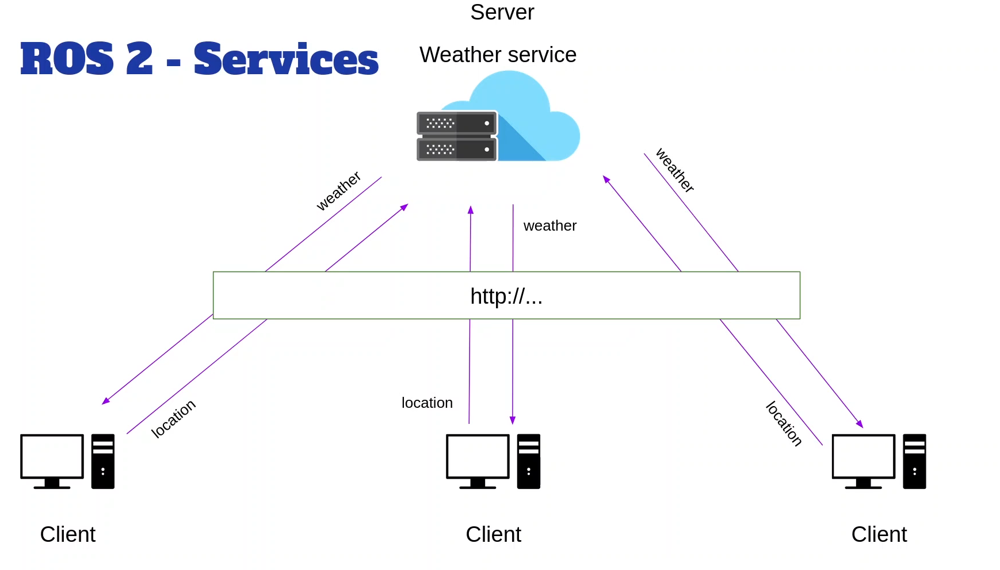

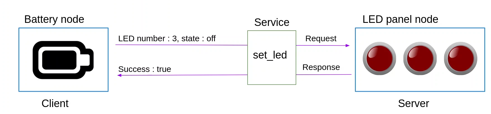


- A ros2 servece is a client/server system
- synchronous or asynchronous
- one message type for request, one message type for response
- can be write in python. c++, ... directly inside ROS nodes
- A service server can only exist once, but can have many clients

show a interface ros2 interface show example_interfaces/srv/AddTwoInts
```bash
ros2 interface show example_interfaces/srv/AddTwoInts
```


## Example of use of services in robot
- Request the robot to move to a given position (client), and wait for the robot to confirm it has reached the position (server).
- Request a sensor reading (client), and wait for the sensor to send back the reading (server).
- Request the robot to perform a specific action (client), and wait for the robot to confirm the action has been completed (server).    


## run the add_two_ints_server
```bash
ros2 run my_py_pkg add_two_ints_server
```

info about services
```bash
ros2 service list
```

```bash
ros2 service info /add_two_ints 
``` 

Test the service from command line
```bash
ros2 service call /add_two_ints example_interfaces/srv/AddTwoInts "{a: 5, b: 3}"
```

## Introspect services with command line
```bash
ros2 service list
```
```bash
ros2 service info /add_two_ints
```
```bash
ros2 service call /add_two_ints example_interfaces/srv/AddTwoInts "{a: 5, b: 3}"
```

View service with rqt

```bash
rqt
```
plugin: Services -> service caller

## Remap a service

rename node
```bash
ros2 run my_py_pkg add_two_ints_server --ros-args -r __node:=my_service_server 
```
rename node and remap service
```bash
ros2 run my_py_pkg add_two_ints_server --ros-args -r __node:=my_service_server -r /add_two_ints:=/my_add_two_ints
```

## Experiment on Turtlesim
Service to reset the simulation
```bash
ros2 service call /reset std_srvs/srv/Empty "{}"
```
Service to spawn a new turtle
```bash
ros2 service call /spawn turtlesim/srv/Spawn "{x: 5.0, y: 5.0, theta: 0.0, name: 'my_turtle'}"
```
Service to kill a turtle
```bash
ros2 service call /kill turtlesim/srv/Kill "{name: 'turtle1'}"
```

## Activity 03 - ROS 2 Services
Let’s practice with ROS 2 Services!

You will start from the Topic activity you did in the last section on Topics.

Here is what you got:
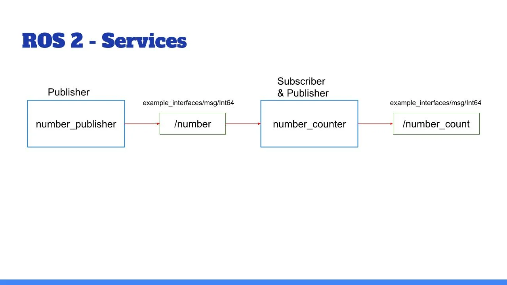

Quick recap:

The node “number_publisher” publishes a number on the /”number” topic.

The node “number_counter” gets the number, adds it to a counter, and publishes the counter on the “/number_count” topic.

And now, here is what you’ll add:
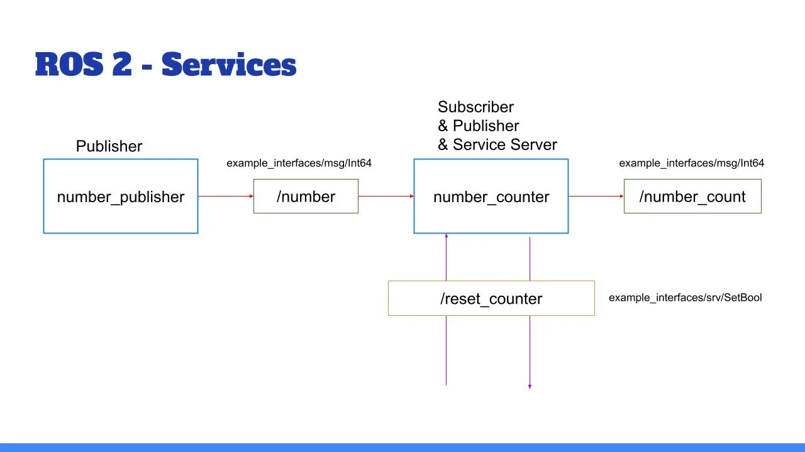

Add a functionality to reset the counter to zero:

Create a service server inside the “number_counter” node.

Service name: “/reset_counter”

Service type: example_interfaces/srv/SetBool. Use “ros2 interface show” to discover what’s inside!

When the server is called, you check the boolean data from the request. If true, you set the counter variable to 0.

We will then call the service directly from the command line. You can also decide - for more practice - to create your own custom node to call this “/reset_counter” service.

And of course, as always, you can do the activity for both the Python and Cpp versions.

I’ll see you in the next lecture for the solution.


call the service from command line
```bash
ros2 service call /reset_counter example_interfaces/srv/SetBool "{data: true}"
```


## Section Conclusion
In this section you have discovered ROS2 Services, and seen how you can use them to add client/server communications between your nodes.

To recap, Services are:

Used for client/server types of communication.

Synchronous or asynchronous (though it’s recommended to use them asynchronously, even if you decide to wait after in the thread).

Anonymous: a client does not know which node is behind the service, it just calls the service. And the server does not know which nodes are clients, it just receives requests and responds to them.

To implement Services inside your nodes:

Create a node or start from an existing one. Add as many Service servers as you want (all with different names)

When you call a Service server from a Service client, make sure that the Service name, as well as the Service type (request + response) are identical.

You can only create one server for a Service, but you can create many clients.

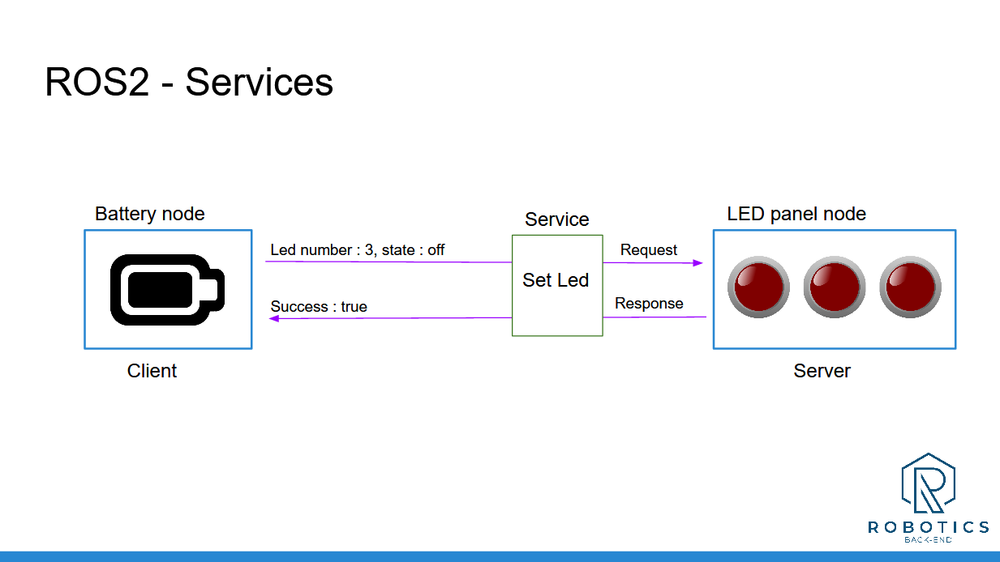

When you want to add a new communication between your nodes, ask yourself this question: “Am I just sending some data, or do I expect a response after I send the message?”. This will tell you if you need to use a Topic or a Service. And, as you progress with ROS2, it will eventually become quite obvious for you.


So, now you can create nodes and make them communicate between each other. But, you’ve only used existing messages so far. What if you need to use other message types for your Topics and Services?

Well, in this case, you’ll need to build your own message types, and that’s what we’ll see in the next section.


__________________________________


Download the complete code for this section (this is the code from all previous sections + the current one).