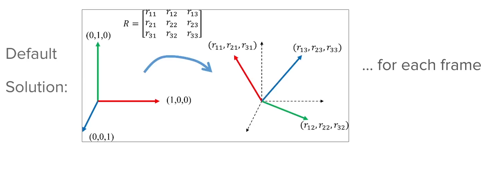

## Intro to TF (Transform)
- Intuitive approach
- Practice over lots of theory

What is TF?
- Package that lets the user keep track of multiple coordinate frames over time
- Maintains the relationship between coordinate frames in a tree structure
- Allows transforming points, vectors, etc between any two coordinate frames at any desired point in time
- Useful for robots with multiple sensors and moving parts
- Helps in understanding the spatial relationships between different parts of the robot and its environment
- Essential for tasks like navigation, mapping, and manipulation

## Visualizing TF in RViz

Install tutorial of URDF and TF:
```bash
sudo apt install ros-jazzy-urdf-tutorial
```
Source ROS2:
```bash
source /opt/ros/jazzy/setup.bash
```


```bash
cd /opt/ros/jazzy/share/
ls
cd urdf_tutorial
cd urdf
```

Launch urdf_tutorial with TF:
```bash
ros2 launch urdf_tutorial display.launch.py model:=/opt/ros/jazzy/share/urdf_tutorial/urdf/08-macroed.urdf.xacro
```
## RViz 
RViz is a 3D visualization tool for ROS applications. It allows users to visualize robots, sensor data, and the state of the ROS system in real-time.

Links:
The link are the rigid bodies that make up the robot model. They are connected by joints, which define how the links can move relative to each other.

Tf:
TF (Transform) is a package in ROS that keeps track of multiple coordinate frames over time. It allows users to transform points, vectors, and other geometric data between different coordinate frames.

The representation of the axes in RViz helps users understand the orientation and position of the robot and its components in 3D space. Each axis is color-coded for easy identification:
- Red Axis (X-axis): Represents the forward direction of the robot.
- Green Axis (Y-axis): Represents the left direction of the robot.
- Blue Axis (Z-axis): Represents the upward direction of the robot.
By visualizing the links and TF in RViz, users can gain insights into the robot's structure, movement capabilities, and spatial relationships between its components.

## Relationship between TFs, TF tree
TFs (Transforms) represent the spatial relationships between different coordinate frames in a robotic system. Each TF defines how to convert coordinates from one frame to another, allowing for accurate positioning and orientation of various robot parts and sensors. The TF tree is a hierarchical structure that organizes these transforms, showing how each frame is related to others in the system. The root of the tree is typically the base frame of the robot, and all other frames branch out from it, representing different components like sensors, joints, and end-effectors. This structure enables efficient management and retrieval of spatial information, facilitating tasks such as navigation, manipulation, and sensor data integration in robotics applications.

Install TF2 tools:
```bash
sudo apt install ros-jazzy-tf2-tools
```
source ROS2:
```bash
source /opt/ros/jazzy/setup.bash
```

View TF tree:
```bash
ros2 run tf2_tools view_frames
``` 

## What is the problem do we solve with TF?
What we try achieve with TFs:
- Keep a structured tree for all the joints/frames over time

We want to know:
- How frames are placed relative to one another
- How they move relative to each other

We need to keep track of each frame relative to other frames


- A transformation is simply a translation + a rotation
- You take one object, you move it and rotate it as we are in 3D space, then you have three components for translation (x,y,z) and three for rotation (roll, pitch, yaw).
- So what you would have to do is for each frame of the robot. weel, you will have to compute the transformation with all the other frames of the robot.
- Solution: The ROS TF functionality does this for you, it keeps track of all the frames and their transformations relative to each other in a tree structure.

## How to create TFs with ROS?
- Understanding TF is the most important 
- Then you don't need to implement TF directly, instead, you'll create a URDF file and use existing ROS packages to handle TF for you.